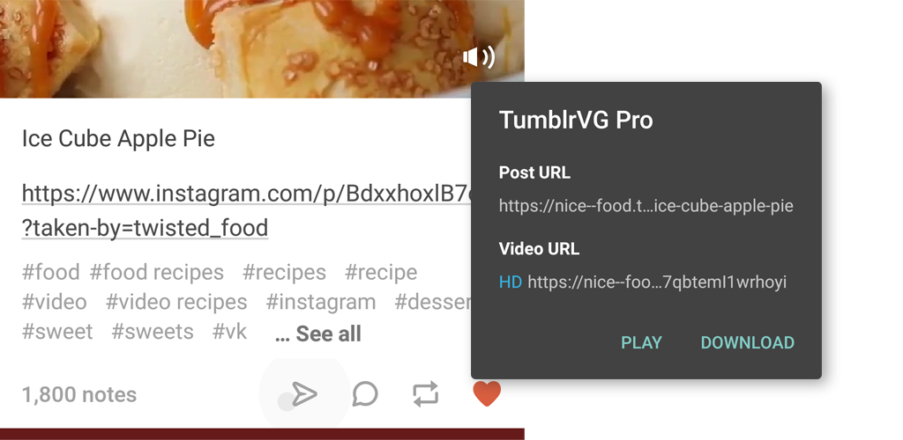

# Tumblr Video Got

A tiny Android app for getting video URL from Tumblr video post URL.

+ How to use?

  Just share a video post from **Tumblr** to the tiny app. Then you'll get the video url for downloading.

+ What's the PRO flavor?
  
  There are two versions, FREE and PRO. Features of PRO:
  
  + HD if available
  + Ignore Tumblr safe mode limitation
  + Invoke APIs for parsing: [urlgot.com](http://www.urlgot.com/), [parsevideo.com](https://parsevideo.com/)

*Copyright &#169; 2018 By_syk. All rights reserved.*